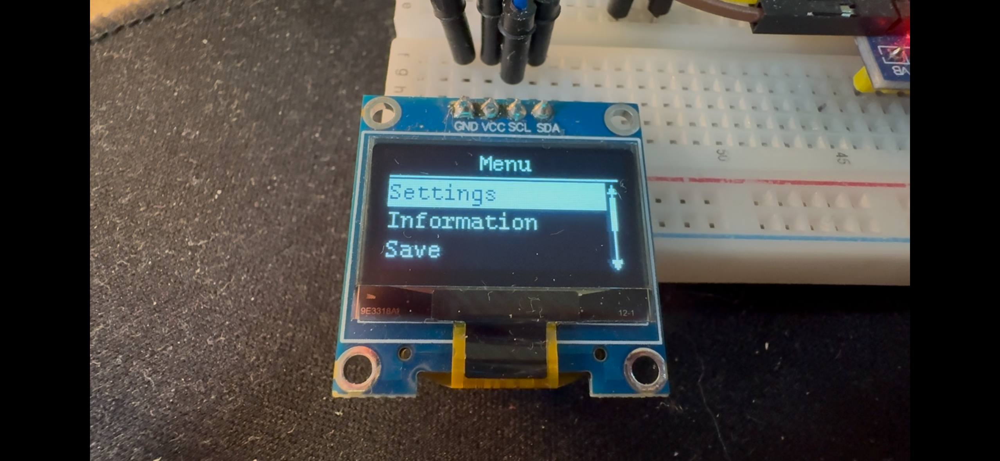
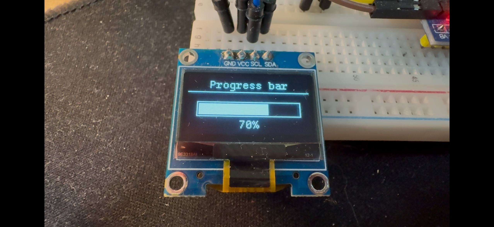

# SSD1306 OLED driver for STM32

Small, self-contained SSD1306 OLED driver for STM32 microcontrollers (F1 / L1) with an internal framebuffer, UTF-8 text rendering and a simple UI helper layer (menus, headers, progress bars, scrollbars).

The library is intended to be embedded into firmware projects (CubeIDE / Keil / etc.) as a third-party component.

---

## Features

- C99, no HAL dependency
  - Depends only on CMSIS device headers (`stm32f1xx.h` / `stm32l1xx.h`).
  - Uses direct I2C register access and internal timing helpers (DWT-based when available).
   
## Capabilities 

- **Supported MCUs**
  - `STM32F1`
  - `STM32L1`

### Display control
- Initialization and power control
- Contrast and invert mode
- Full screen clear / fill
- Supports 128×64 and 64×32 SSD1306 panels (selected via ssd1306_conf.h)

### Rendering model
- Full 1-bit framebuffer in RAM
- **Partial redraw (dirty regions):** driver updates only changed areas
- Efficient for menus, bars, indicators and rapidly changing UI

### Text rendering
- UTF-8 input (configurable)
- Multiple built-in bitmap fonts (8×8, 7×14, 11×21, 16×30)
- Fast string rendering using the internal framebuffer
- Optional alignment and clipping

### Drawing primitives
- Pixels, lines, rectangles (outline/filled)
- Triangles (outline/filled)
- Circles (outline/filled)
- 1-bit bitmaps (icons, logos)
- All primitives draw into the framebuffer and respect clipping

### High-level UI helpers
A small but practical UI layer on top of the framebuffer:
- **Headers** (left/center/right align, underline styles)
- **Progress bars** (value 0-100, optional percentage text)
- **Scrollbars** (vertical/horizontal)
- **Vertical menus** with scrolling and active item highlight  
  (ideal for simple device interfaces)

### Timing and portability
- DWT-based high-resolution delays (fallback included)
- No HAL, only CMSIS headers
- I2C access implemented in a single port file  
  → easy to adapt to another STM32 or another MCU family

## Integration
Copy the `include/` and `src/` folders into your project and add `include/` to your include paths.

Configuration is done in `ssd1306_conf.h`:
- select your display type
- enable fonts
- set I2C instance and address

## Showcase

### Screenshots




### Deployed in a real industrial-grade device
This SSD1306 driver is used in a precision resistance-emulation device featuring a bank of selectable reference resistors with fine adjustment capability.  
The video below shows the library driving the full UI of the instrument in real time on STM32 hardware.


## Quick start

```c
#include "ssd1306.h"

void ssd1306_example_showcase(void);

int main(void) {
	ssd1306_init();
	ssd1306_example_showcase();

	while (1) { }
}
```

---

## Directory layout
```text
ssd1306/
  include/
    ssd1306.h         # Public API
    ssd1306_conf.h    # User configuration (I2C pins, display type, fonts, charset)
    ssd1306_ui.h      # Public UI helpers (menus, headers, progress bars)

  src/
    ssd1306.c         # Public API implementation
    ssd1306_priv.c    # Internal state, framebuffer, dirty region tracking
    ssd1306_port.c    # Low-level I2C access (register-level)
    ssd1306_utils.c   # Geometry + timing helpers (DWT when available)
    ssd1306_fonts.c   # Built-in font bitmaps
    ssd1306_ui.c      # High-level UI widgets (menus, headers, bars)

    inc/              # Internal headers (not exposed to user code)
      ssd1306_cmd.h
      ssd1306_priv.h
      ssd1306_port.h
      ssd1306_utils.h
      ssd1306_fonts.h

  assets/
    ssd1306_images.c
    ssd1306_images.h

  examples/
    ssd1306_demo.c    # Minimal usage example

  LICENSE
  README.md

